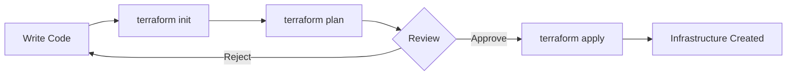

# Getting Started with Terraform

Terraform by HashiCorp is the industry-leading Infrastructure as Code tool for managing cloud infrastructure across multiple providers. This guide will get you started with Terraform fundamentals.

## What is Terraform?

!!! info "Terraform at a Glance"

    - **Multi-Cloud**: Works with AWS, Azure, GCP, and 3000+ providers
    - **Declarative**: Define desired state, Terraform handles the rest
    - **State Management**: Tracks infrastructure changes over time
    - **Plan & Apply**: Preview changes before deployment

## Prerequisites

Before you begin, ensure you have:

- [x] Cloud provider account (Azure, AWS, or GCP)
- [x] Terraform CLI installed
- [x] VS Code with HashiCorp Terraform extension
- [x] Basic command-line knowledge

## Installation

### Install Terraform

=== "Windows"

    ```powershell
    # Using winget
    winget install HashiCorp.Terraform

    # Or using Chocolatey
    choco install terraform

    # Verify installation
    terraform version
    ```

=== "macOS"

    ```bash
    # Using Homebrew
    brew tap hashicorp/tap
    brew install hashicorp/tap/terraform

    # Verify installation
    terraform version
    ```

=== "Linux"

    ```bash
    # Ubuntu/Debian
    wget -O- https://apt.releases.hashicorp.com/gpg | sudo gpg --dearmor -o /usr/share/keyrings/hashicorp-archive-keyring.gpg
    echo "deb [signed-by=/usr/share/keyrings/hashicorp-archive-keyring.gpg] https://apt.releases.hashicorp.com $(lsb_release -cs) main" | sudo tee /etc/apt/sources.list.d/hashicorp.list
    sudo apt update && sudo apt install terraform

    # Verify installation
    terraform version
    ```

### VS Code Extension

Install the HashiCorp Terraform extension for the best development experience:

1. Open VS Code
2. Go to Extensions (Ctrl+Shift+X)
3. Search for "HashiCorp Terraform"
4. Install the official extension

## Your First Terraform Configuration

### Project Structure

Create a new directory and add these files:

```
📁 terraform-demo/
  📄 main.tf
  📄 variables.tf
  📄 outputs.tf
  📄 providers.tf
  📄 terraform.tfvars
```

### providers.tf - Configure the Provider

```hcl
# providers.tf

terraform {
  required_version = ">= 1.5.0"

  required_providers {
    azurerm = {
      source  = "hashicorp/azurerm"
      version = "~> 3.85.0"
    }
  }
}

provider "azurerm" {
  features {
    key_vault {
      purge_soft_delete_on_destroy = false
    }
  }
}
```

### variables.tf - Define Variables

```hcl
# variables.tf

variable "resource_group_name" {
  description = "Name of the resource group"
  type        = string
}

variable "location" {
  description = "Azure region for resources"
  type        = string
  default     = "eastus"
}

variable "storage_account_name" {
  description = "Name of the storage account"
  type        = string

  validation {
    condition     = length(var.storage_account_name) >= 3 && length(var.storage_account_name) <= 24
    error_message = "Storage account name must be between 3 and 24 characters."
  }
}

variable "environment" {
  description = "Environment name"
  type        = string
  default     = "dev"

  validation {
    condition     = contains(["dev", "staging", "prod"], var.environment)
    error_message = "Environment must be dev, staging, or prod."
  }
}
```

### main.tf - Define Resources

```hcl
# main.tf

# Resource Group
resource "azurerm_resource_group" "main" {
  name     = var.resource_group_name
  location = var.location

  tags = {
    Environment = var.environment
    ManagedBy   = "Terraform"
  }
}

# Storage Account
resource "azurerm_storage_account" "main" {
  name                     = var.storage_account_name
  resource_group_name      = azurerm_resource_group.main.name
  location                 = azurerm_resource_group.main.location
  account_tier             = "Standard"
  account_replication_type = var.environment == "prod" ? "GRS" : "LRS"

  min_tls_version                 = "TLS1_2"
  enable_https_traffic_only       = true
  allow_nested_items_to_be_public = false

  blob_properties {
    versioning_enabled = var.environment == "prod"

    container_delete_retention_policy {
      days = 7
    }
  }

  tags = {
    Environment = var.environment
    ManagedBy   = "Terraform"
  }
}
```

### outputs.tf - Define Outputs

```hcl
# outputs.tf

output "resource_group_id" {
  description = "The ID of the resource group"
  value       = azurerm_resource_group.main.id
}

output "storage_account_id" {
  description = "The ID of the storage account"
  value       = azurerm_storage_account.main.id
}

output "storage_account_primary_endpoint" {
  description = "The primary blob endpoint"
  value       = azurerm_storage_account.main.primary_blob_endpoint
}
```

### terraform.tfvars - Set Variable Values

```hcl
# terraform.tfvars

resource_group_name  = "rg-terraform-demo"
location             = "eastus"
storage_account_name = "stterraformdemo123"
environment          = "dev"
```

## Deploy Your First Resource

### Step 1: Login to Azure

```bash
az login
```

### Step 2: Initialize Terraform

```bash
terraform init
```

This downloads the required providers and initializes the backend.

### Step 3: Plan the Deployment

```bash
terraform plan
```

Review the execution plan to see what Terraform will create.

### Step 4: Apply the Configuration

```bash
terraform apply
```

Type `yes` when prompted to confirm the deployment.

### Step 5: Verify the Deployment

```bash
# Show the current state
terraform show

# List outputs
terraform output
```

## Understanding the Workflow



### Core Commands

| Command | Purpose |
|---------|---------|
| `terraform init` | Initialize working directory |
| `terraform plan` | Preview changes |
| `terraform apply` | Apply changes |
| `terraform destroy` | Destroy infrastructure |
| `terraform fmt` | Format code |
| `terraform validate` | Validate configuration |

## State Management

Terraform tracks your infrastructure in a state file. For team environments, use remote state:

```hcl
# backend.tf - Azure Storage backend

terraform {
  backend "azurerm" {
    resource_group_name  = "rg-terraform-state"
    storage_account_name = "stterraformstate"
    container_name       = "tfstate"
    key                  = "demo.terraform.tfstate"
  }
}
```

!!! warning "State File Security"

    - Never commit `terraform.tfstate` to version control
    - The state file may contain sensitive information
    - Always use remote backends for team projects

## Clean Up

To destroy all resources:

```bash
terraform destroy
```

## What's Next?

Now that you've deployed your first Terraform resource, explore:

- [Terraform Modules](modules.md) - Create reusable modules
- [Best Practices](best-practices.md) - Write production-ready code
- [Examples](examples.md) - Real-world deployment examples

---

!!! tip "Pro Tip"

    Use `-auto-approve` flag to skip the confirmation prompt in CI/CD pipelines:

    ```bash
    terraform apply -auto-approve
    ```

    **Never use this flag for manual deployments** - always review the plan!
